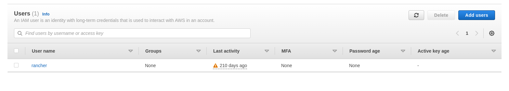
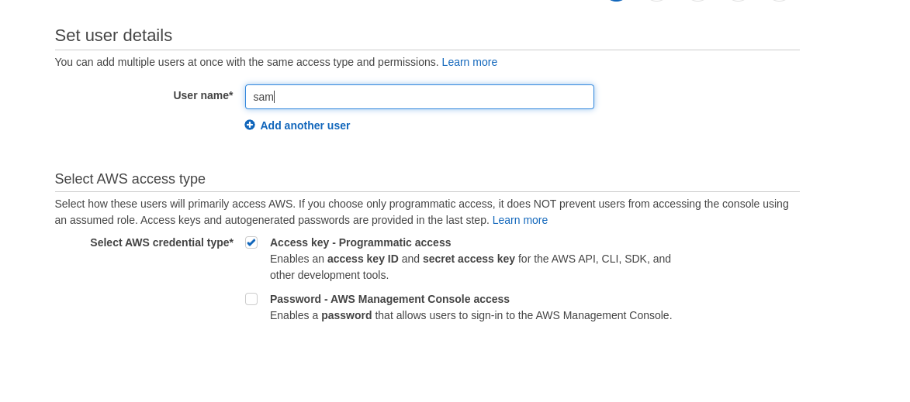
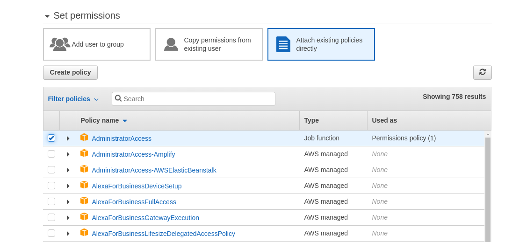
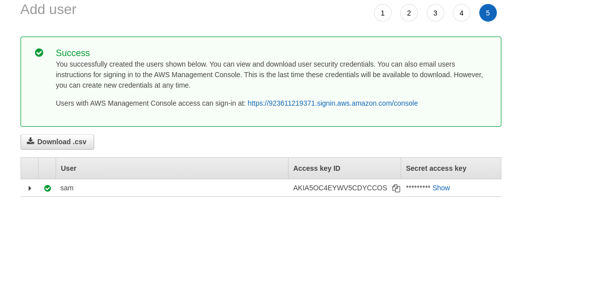
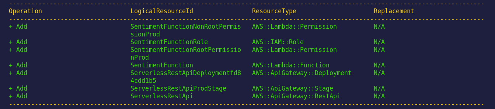
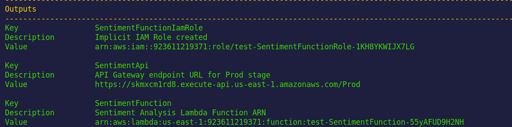
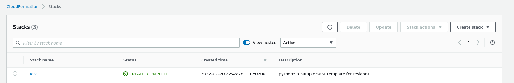
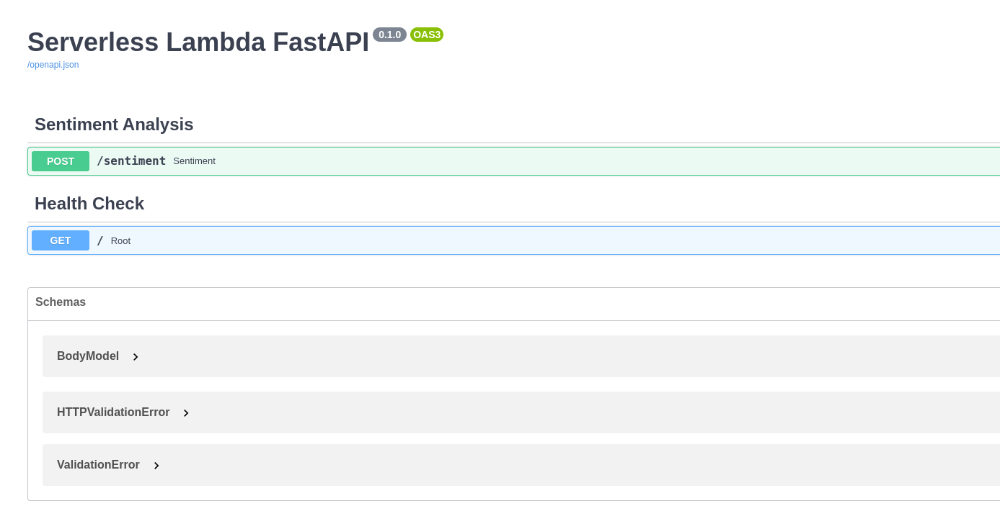
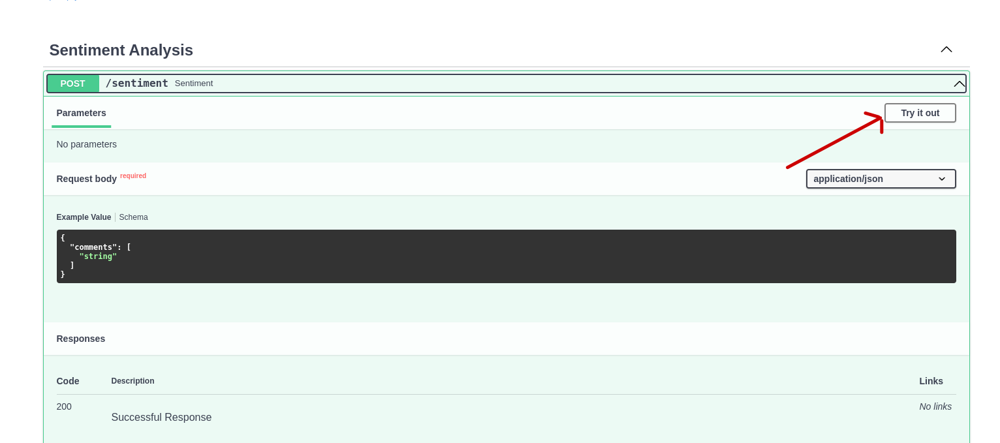
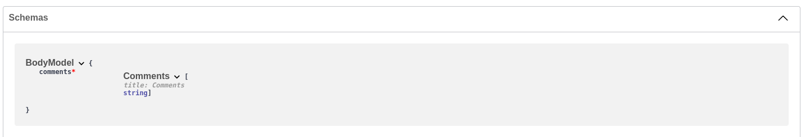

<p align = "center" draggable=”false” >
</p>


# <h1 align="center" id="heading">Phase VI - Sentiment Analysis using FastAPI and AWS Lambda</h1>


## ☑️ Objectives
At the end of this session, you will have a brief understanding of how to:
- [ ] Implement your ML App on AWS Lambda
- [ ] Implement FastAPI with your ML App
- [ ] Deploy your ML App to a public endpoint


## Tasks
There's only one tasks for this session.
1. Complete the directions in this README

## How to Submit GitHub Exercise
- Submit a link to your endpoint link on canvas (this link should be unique to your project).

## Background
Please review the weekly narrative [here](https://www.notion.so/Week-3-Analyzing-Market-Sentiment-Phase-VI-Moving-to-a-Managed-Stack-3d50ad3111834aebb78920c6ba15b8d1)


# Tesla Sentiment Analysis API

This project contains source code and supporting files for a serverless application that you can deploy with the SAM CLI. It includes the following files and folders.

- app.py - Code for the fastapi definition.
- events - Invocation events that you can use to invoke the function.
- template.yaml - A template that defines the application's AWS resources.

The application uses several AWS resources, including Lambda functions and an API Gateway API. These resources are defined in the `template.yaml` file in this project. You can update the template to add AWS resources through the same deployment process that updates your application code.


     
     
     
     
 
<details>
     <summary><b>Before we Get Started</b></summary>    
     
     
## I. Dependencies

The Serverless Application Model Command Line Interface (SAM CLI) is an extension of the AWS CLI that adds functionality for building and testing Lambda applications. It uses Docker to run your functions in an Amazon Linux environment that matches Lambda. It can also emulate your application's build environment and API.

To use the SAM CLI, you need the following tools.
### I.1 AWS account creation

Follow the next tutorial to create and verify an AWS account

<https://aws.amazon.com/premiumsupport/knowledge-center/create-and-activate-aws-account/>

### I.2 Docker installation

Use the convenience script to install docker on linux. For more

```bash
 curl -fsSL <https://get.docker.com> -o get-docker.sh
 DRY_RUN=1 sh ./get-docker.sh
```

Verify that your user can run docker commandas ccan run Docker commands without using sudo.by
running by running the following command:

```bash
  docker ps

 CONTAINER ID        IMAGE               COMMAND             CREATED             STATUS              PORTS               NAMES

```


### I.3 SAM CLI installation

AWS SAM provides you with a command line tool, the AWS SAM CLI, that makes it easy for you to create and manage serverless applications. You need to install and configure a few things in order to use the AWS SAM CLI.

1. Download SAM CLI to a folder of your choice using CURL/WGET or directly using your browser [aws-sam-cli] <https://github.com/aws/aws-sam-cli/releases/latest/download/aws-sam-cli-linux-x86_64.zip>
2. unzip the file to sam-installation

```bash
unzip aws-sam-cli-linux-x86_64.zip -d sam-installation
```

3. Install the AWS SAM CLI.  

```bash
   sudo ./sam-installation/install
```
4. Verify the installation using

```bash
  sam --version
```
1. On successful installation, you should see output like the following:

```bash
SAM CLI, version 1.53.0
```

For more information [Install the SAM CLI](https://docs.aws.amazon.com/serverless-application-model/latest/developerguide/serverless-sam-cli-install.html)

### I.4 Python

You may need the following for local testing.

- [Python 3 installed](https://www.python.org/downloads/)
 
</details>


<details>
     <summary><b>Use the SAM CLI to Build and Test Locally</b></summary>


## II. Use the SAM CLI to Build and Test Locally

To build and deploy your application for the first time, run the following in your shell:

```bash
teslabot$ sam build
```

The SAM CLI builds a docker image from a Dockerfile and then installs dependencies defined in `requirements.txt` inside the docker image. The processed template file is saved in the `.aws-sam/build` folder.

Test a single function by invoking it directly with a test event. An event is a JSON document that represents the input that the function receives from the event source. Test events are included in the `events` folder in this project.

Run functions locally and invoke them with the `sam local invoke` command.

```bash
teslabot$ sam local invoke SentimentFunction --event events/event.json
```

You should see an output as the following:

```bash
END RequestId: d50fec76-633a-4c9c-ba55-87eee6f3b5ee
REPORT RequestId: d50fec76-633a-4c9c-ba55-87eee6f3b5ee  Init Duration: 0.15 ms  Duration: 1985.42 ms    Billed Duration: 1986 ms   Memory Size: 1024 MB     Max Memory Used: 1024 MB
{"statusCode": 200, "headers": {"content-length": "60", "content-type": "application/json"}, "multiValueHeaders": {}, "body": "{\"result\":[{\"label\":\"NEGATIVE\",\"score\":0.5557698011398315}]}", "isBase64Encoded": false}

```

This will give us an idea of the latency of our request, and how many memory it is using.


</details>

     
     
     


<details>
     <summary><b>Deploy on AWS</b></summary>

## III. Deploy on AWS

### III.1 Generating user credentials

1. Make sure that you have an active AWS account
2. Select us-east-1 as the aws region for the remaining steps of the assignment.
  
3. Go to ![Identity and Access Management (IAM)] <https://us-east-1.console.aws.amazon.com/iamv2/home#/users>
and add a new user by clicking on "add users"

3. Pick a name for the user (let's same it sam). and give it programmatic access using access key
   

4. Add permissions to the newly created user as the following
   

   **PLEASE NOTE THAT IT IS CONSIDERED A BAD PRACTICE TO GIVE A USER FULL ADMIN ACCESS. IDEALLY IT SHOULD BE ATTACHED TO POLICIES ACCORDING TO THE LEAST PRIViLEGE PRINCIPLE. WE ARE STRICLY USING THIS FOR THE CURRENT ASSIGNMENT TO REDUCE ISSUES RELATED TO RUNNING IT**
   
5. Proceed into the last step where you will be able to download the client ID and the client secret
  

5. The next step is set the credentials as environment variables. On your open terminal, run the following commands:


```bash
   export AWS_ACCESS_KEY_ID=your_access_key_id
   export AWS_SECRET_ACCESS_KEY=your_secret_access_key
```
while replacing your_access_key_id and your_secret_access_key with the values you find in the csv file you downloaded earlier

### III.2 Deploying using SAM CLI

The command will package and deploy your application to AWS, with a series of prompts:

```bash
sam deploy --guided
```


- **Stack Name**: The name of the stack to deploy to CloudFormation. This should be unique to your account and region, and a good starting point would be something matching your project name.
- **AWS Region**: The AWS region you want to deploy your app to.
- **Confirm changes before deploy**: If set to yes, any change sets will be shown to you before execution for manual review. If set to no, the AWS SAM CLI will automatically deploy application changes. 
- **Allow SAM CLI IAM role creation**: Many AWS SAM templates, including this example, create AWS IAM roles required for the AWS Lambda function(s) included to access AWS services. By default, these are scoped down to minimum required permissions. To deploy an AWS CloudFormation stack which creates or modifies IAM roles, the `CAPABILITY_IAM` value for `capabilities` must be provided. If permission isn't provided through this prompt, to deploy this example you must explicitly pass `--capabilities CAPABILITY_IAM` to the `sam deploy` command.
- **Save arguments to samconfig.toml**: If set to yes, your choices will be saved to a configuration file inside the project, so that in the future you can just re-run `sam deploy` without parameters to deploy changes to your application.


You can find your API Gateway Endpoint URL in the output values displayed after deployment.




We can also the deployment on [Cloud Formation stacks page](https://us-east-1.console.aws.amazon.com/cloudformation/home?region=us-east-1)




### III.3 Testing the API endpoint


* Open your browser on the docs route to see the API documentation. You can have it by appending /docs to the API Gateway Endpoint URL




* The documentation enables you to test your API directly by clicking on "Let's try out" button on the left as shown in the next picture.



* Once you do that. You can provide and run a query from the documentation directly ! Try it out by changing the provided request body to :

```json
{"comments": ["This is awesome !", "Tesla is not doing great in my opinion"] }
```

Note that the API accepts only request body that matches the format we have provided in the api definition.



- Try providing a request body that violates the defined request schema. Can you explain the error message ?

```json
{"comments": "This is awesome !"}
```

### III.4 Fetch, tail, and filter Lambda function logs

To simplify troubleshooting, SAM CLI has a command called `sam logs`. `sam logs` lets you fetch logs generated by your deployed Lambda function from the command line. In addition to printing the logs on the terminal, this command has several nifty features to help you quickly find the bug.

`NOTE`: This command works for all AWS Lambda functions; not just the ones you deploy using SAM.

```bash
teslabot$ sam logs  --stack-name <stack-name> --tail --region us-east-1
```

You can find more information and examples about filtering Lambda function logs in the [SAM CLI Documentation](https://docs.aws.amazon.com/serverless-application-model/latest/developerguide/serverless-sam-cli-logging.html).

</details>


### Cleanup

To delete the sample application that you created, use the AWS CLI. Assuming you used your project name for the stack name, you can run the following:

```bash
aws cloudformation delete-stack --stack-name <stack-name> --region us-east-1
```

if we head to <https://us-east-1.console.aws.amazon.com/cloudformation/home?region=us-east-1> we will notice that our stack doesn't exist anymore


### Resources

See the [AWS SAM developer guide](https://docs.aws.amazon.com/serverless-application-model/latest/developerguide/what-is-sam.html) for an introduction to SAM specification, the SAM CLI, and serverless application concepts.

Next, you can use AWS Serverless Application Repository to deploy ready to use Apps that go beyond hello world samples and learn how authors developed their applications: [AWS Serverless Application Repository main page](https://aws.amazon.com/serverless/serverlessrepo/)

### Adding a Resource to your Application

The application template uses AWS Serverless Application Model (AWS SAM) to define application resources. AWS SAM is an extension of AWS CloudFormation with a simpler syntax for configuring common serverless application resources such as functions, triggers, and APIs. For resources not included in [the SAM specification](https://github.com/awslabs/serverless-application-model/blob/master/versions/2016-10-31.md), you can use standard [AWS CloudFormation](https://docs.aws.amazon.com/AWSCloudFormation/latest/UserGuide/aws-template-resource-type-ref.html) resource types.
